# Mermaid Diagrams - Visual Architecture

This document contains all Mermaid diagrams for visualizing the secure containerization architecture and workflows.

## Table of Contents

1. [Multi-Stage Build Process](#1-multi-stage-build-process)
2. [Source Code Protection Flow](#2-source-code-protection-flow)
3. [Security Layers](#3-security-layers)
4. [Attack Vectors and Mitigations](#4-attack-vectors-and-mitigations)
5. [Language Comparison](#5-language-comparison)
6. [Container Build Workflow](#6-container-build-workflow)
7. [Runtime Architecture](#7-runtime-architecture)
8. [Reverse Engineering Difficulty](#8-reverse-engineering-difficulty)
9. [Decision Tree](#9-decision-tree)
10. [Protection Techniques](#10-protection-techniques)

---

## 1. Multi-Stage Build Process

### General Multi-Stage Build Flow

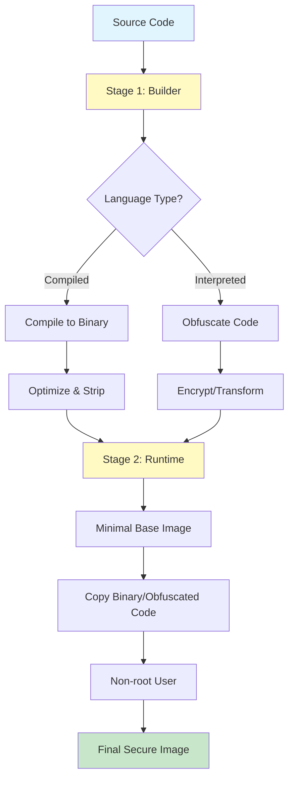

### Go Multi-Stage Build

### C++ Multi-Stage Build

### Python Multi-Stage Build

### Node.js Multi-Stage Build

---

## 2. Source Code Protection Flow

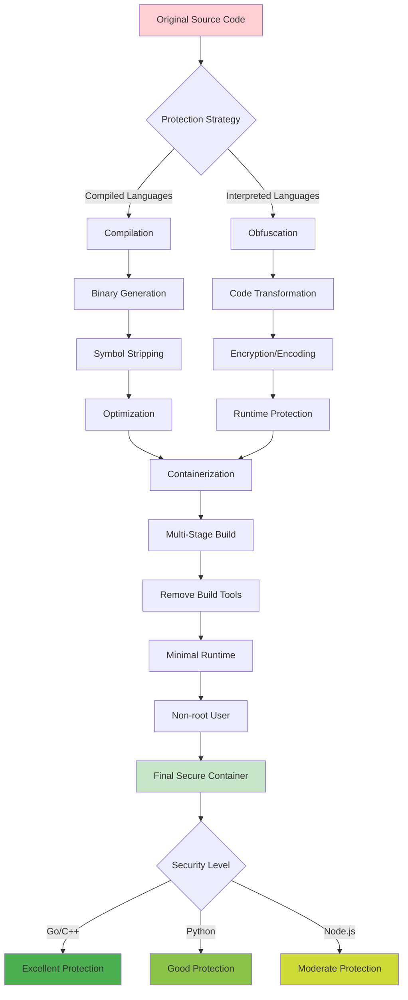

---

## 3. Security Layers

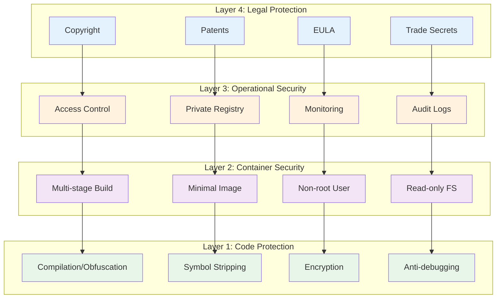

---

## 4. Attack Vectors and Mitigations

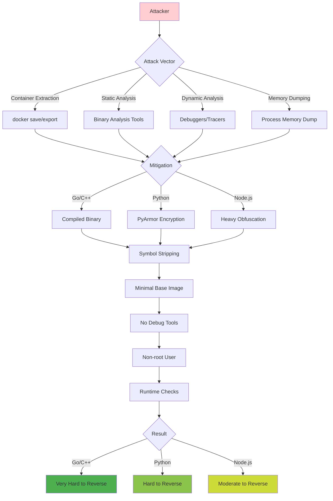

---

## 5. Language Comparison

### Protection Level Comparison

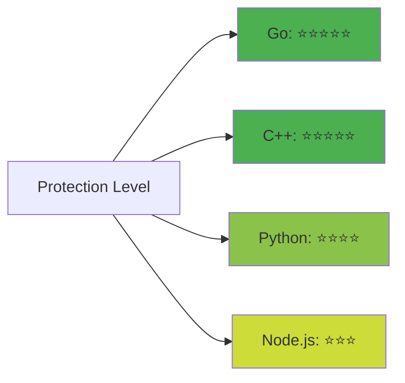

### Image Size vs Security

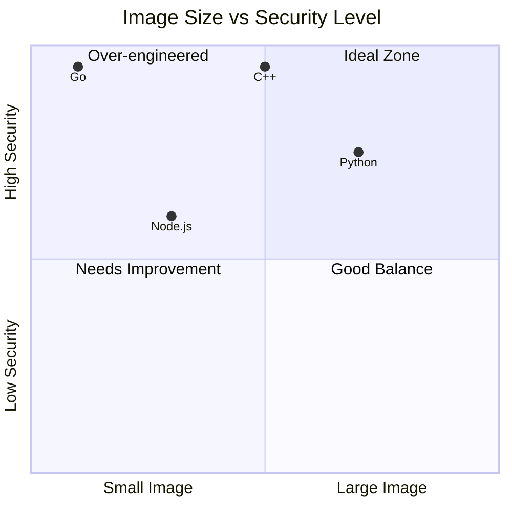

---

## 6. Container Build Workflow

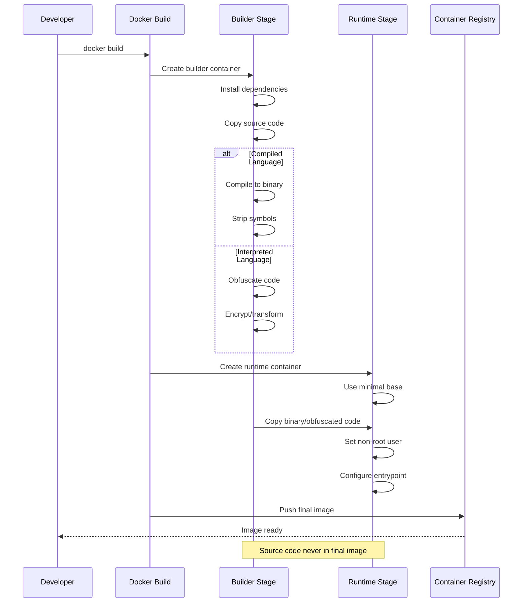

---

## 7. Runtime Architecture

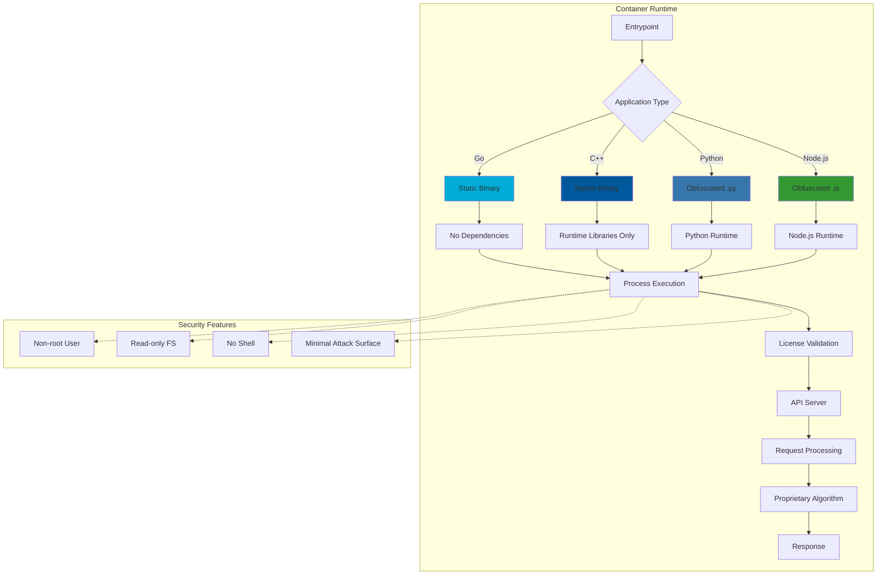

---

## 8. Reverse Engineering Difficulty

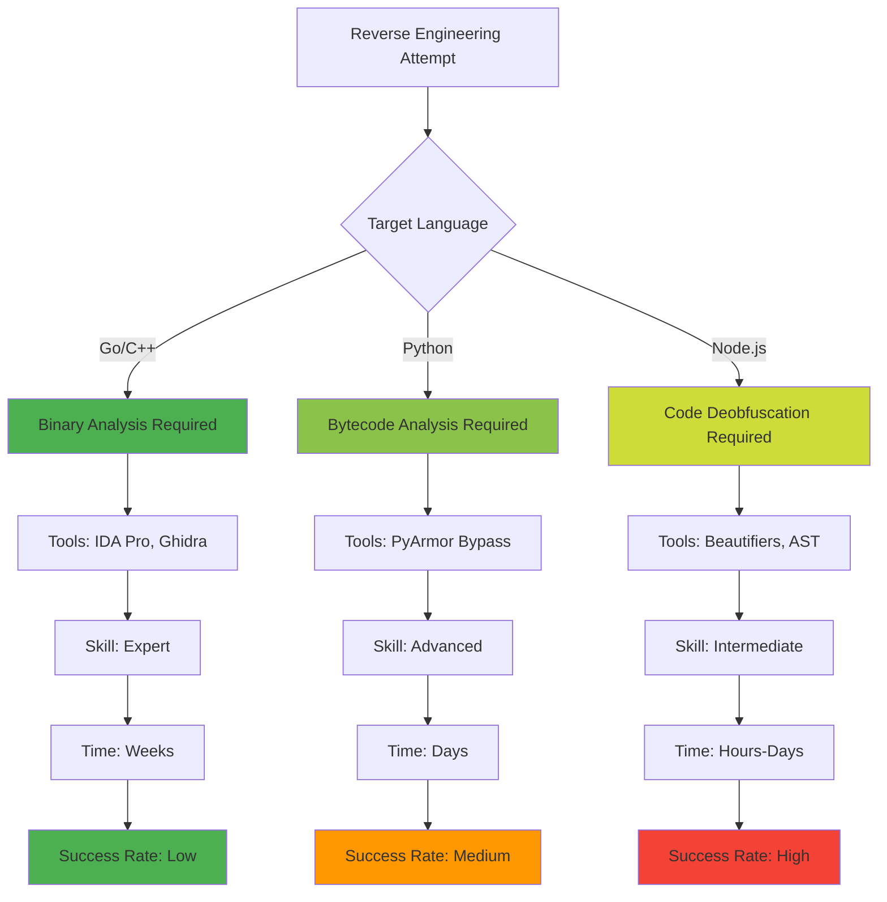

---

## 9. Decision Tree

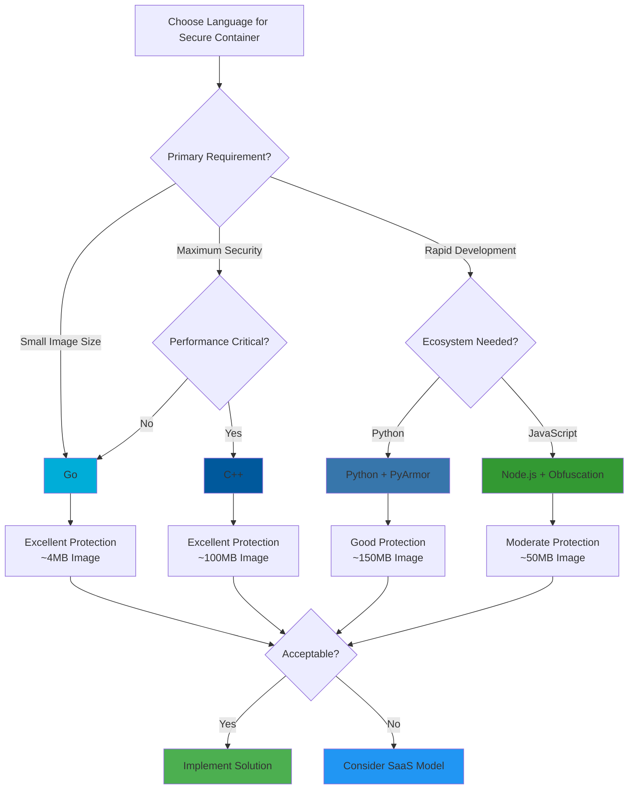

---

## 10. Protection Techniques

### Compilation Process (Go/C++)

```mermaid
flowchart LR
    A[Source Code] --> B[Lexical Analysis]
    B --> C[Syntax Analysis]
    C --> D[Semantic Analysis]
    D --> E[Intermediate Code]
    E --> F[Optimization]
    F --> G[Code Generation]
    G --> H[Machine Code]
    H --> I[Symbol Stripping]
    I --> J[Final Binary]
    
    style A fill:#ffcdd2
    style J fill:#c8e6c9
```

### Obfuscation Process (Python/Node.js)

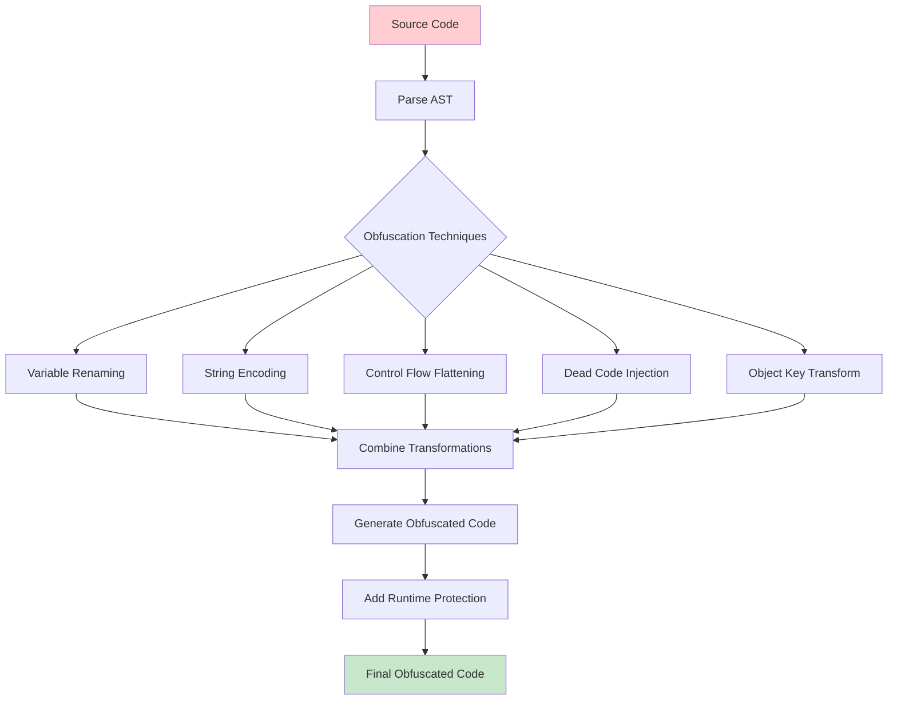

### Complete Protection Stack

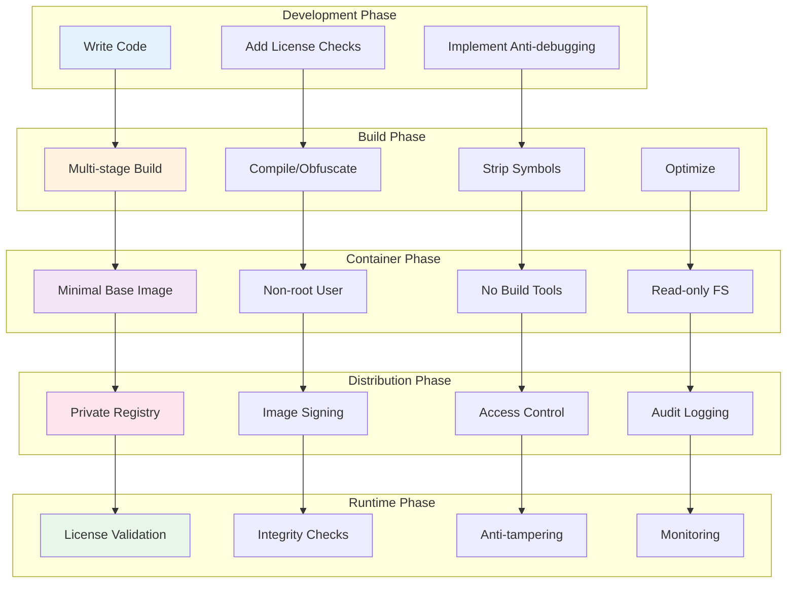

---

## Usage in Documentation

These diagrams can be rendered in any Markdown viewer that supports Mermaid, including:
- GitHub
- GitLab
- VS Code (with Mermaid extension)
- Online Mermaid editors

To view these diagrams:
1. Copy the Mermaid code
2. Paste into a Mermaid-compatible viewer
3. Or view directly in GitHub/GitLab

## Diagram Legend

- 🟢 Green: Secure/Protected
- 🟡 Yellow: Moderate Protection
- 🔴 Red: Vulnerable/Unprotected
- 🔵 Blue: Process/Action
- ⚪ White: Neutral/Information

## Additional Resources

- [Mermaid Documentation](https://mermaid.js.org/)
- [Mermaid Live Editor](https://mermaid.live/)
- [GitHub Mermaid Support](https://github.blog/2022-02-14-include-diagrams-markdown-files-mermaid/)