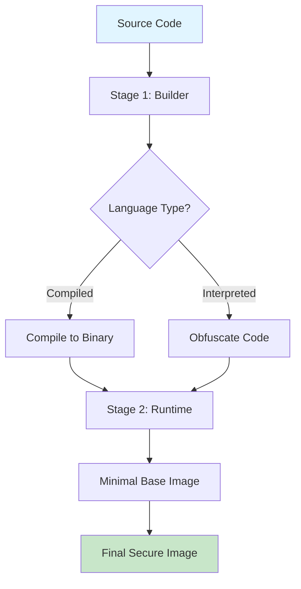
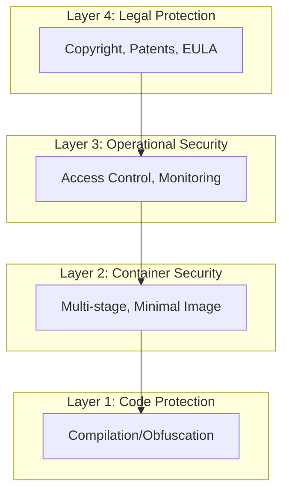

# Secure Container Code - Source Code Protection in Containers

[](LICENSE)
[](https://www.docker.com/)
[](Docs/06-Security-Analysis.md)

A comprehensive demonstration of source code protection techniques in containerized applications across four popular programming languages: **Go**, **C++**, **Python**, and **Node.js**.

## 🎯 Project Overview

This project showcases best practices for protecting proprietary algorithms and intellectual property when distributing containerized applications. Each implementation demonstrates different protection strategies while maintaining functionality and security.

### Key Features

- ✅ **Multi-stage Docker builds** - Separate build and runtime environments
- ✅ **Source code protection** - Compilation and obfuscation techniques
- ✅ **Minimal container images** - Reduced attack surface
- ✅ **Security best practices** - Non-root users, no debug tools
- ✅ **Production-ready** - Complete working applications
- ✅ **Comprehensive documentation** - Detailed guides and analysis

## 📊 Quick Comparison

| Language | Protection Method | Security Level | Image Size | Best For |
|----------|------------------|----------------|------------|----------|
| **Go** | Compiled binary + distroless | ⭐⭐⭐⭐⭐ | ~4MB | Maximum security |
| **C++** | Compiled binary + minimal base | ⭐⭐⭐⭐⭐ | ~100MB | High performance |
| **Python** | PyArmor obfuscation | ⭐⭐⭐⭐ | ~150MB | Rapid development |
| **Node.js** | JavaScript obfuscation | ⭐⭐⭐ | ~50MB | Web services |

## 🚀 Quick Start

### Prerequisites

- Docker 20.10 or later
- Docker Compose (optional)
- 4GB RAM minimum
- 10GB disk space

### Build and Run Any Application

```bash
# Go Application
cd go-app
docker build -t secure-go-app .
docker run -p 8080:8080 secure-go-app

# C++ Application
cd cpp-app
docker build -t secure-cpp-app .
docker run -p 8080:8080 secure-cpp-app

# Python Application
cd python-app
docker build -t secure-python-app .
docker run -p 8080:8080 secure-python-app

# Node.js Application
cd nodejs-app
docker build -t secure-nodejs-app .
docker run -p 8080:8080 secure-nodejs-app
```

**Note:** For comprehensive build testing and troubleshooting, see [BUILD-VERIFICATION.md](BUILD-VERIFICATION.md).

### Test the Applications

```bash
# Health check
curl http://localhost:8080/health

# Process data
curl -X POST "http://localhost:8080/process?data=test123"

# Expected response:
# {"input":"test123","processed":"<hash>","algorithm":"<language>-proprietary-v1"}
```

## 📁 Project Structure

```
secure-container-code/
├── go-app/              # Go application with distroless container
│   ├── main.go
│   ├── go.mod
│   ├── Dockerfile
│   └── .dockerignore
├── cpp-app/             # C++ application with minimal runtime
│   ├── main.cpp
│   ├── Dockerfile
│   └── .dockerignore
├── python-app/          # Python application with PyArmor
│   ├── app.py
│   ├── requirements.txt
│   ├── Dockerfile
│   └── .dockerignore
├── nodejs-app/          # Node.js application with obfuscation
│   ├── app.js
│   ├── package.json
│   ├── Dockerfile
│   └── .dockerignore
├── Docs/                # Comprehensive documentation
│   ├── 01-Overview.md
│   ├── 02-Go-Application.md
│   ├── 03-Cpp-Application.md
│   ├── 04-Python-Application.md
│   ├── 05-NodeJS-Application.md
│   ├── 06-Security-Analysis.md
│   └── 07-Mermaid-Diagrams.md
└── README.md            # This file
```

## 🔒 Security Features

### Common to All Applications

1. **Multi-stage builds** - Source code never reaches final image
2. **Minimal base images** - Reduced attack surface
3. **Non-root users** - Enhanced security
4. **No build tools** - Compilers/obfuscators removed
5. **License validation** - Runtime checks
6. **Proprietary algorithms** - Protected business logic

### Language-Specific Protection

#### Go (Highest Security)
- Static binary compilation
- Symbol stripping (`-ldflags="-s -w"`)
- Distroless container (no shell)
- ~4MB final image

#### C++ (Highest Security)
- Native compilation with `-O3` optimization
- Complete symbol stripping
- Minimal Debian slim base
- ~100MB final image

#### Python (Good Security)
- PyArmor bytecode encryption
- String and constant obfuscation
- Runtime protection
- ~150MB final image

#### Node.js (Moderate Security)
- Heavy JavaScript obfuscation
- Control flow flattening
- Dead code injection
- ~50MB final image

## 📚 Documentation

Comprehensive documentation is available in the `Docs/` folder:

1. **[Overview](Docs/01-Overview.md)** - Project introduction and concepts
2. **[Go Application](Docs/02-Go-Application.md)** - Go implementation details
3. **[C++ Application](Docs/03-Cpp-Application.md)** - C++ implementation details
4. **[Python Application](Docs/04-Python-Application.md)** - Python implementation details
5. **[Node.js Application](Docs/05-NodeJS-Application.md)** - Node.js implementation details
6. **[Security Analysis](Docs/06-Security-Analysis.md)** - Comprehensive security comparison
7. **[Mermaid Diagrams](Docs/07-Mermaid-Diagrams.md)** - Visual architecture diagrams

## 🎨 Architecture Diagrams

### Multi-Stage Build Process



### Security Layers



More diagrams available in [Mermaid Diagrams](Docs/07-Mermaid-Diagrams.md).

## 🛡️ Security Considerations

### What's Protected

✅ Source code is NOT in final images  
✅ Build tools are NOT in final images  
✅ Debug symbols are stripped (compiled languages)  
✅ Code is obfuscated (interpreted languages)  
✅ Minimal attack surface  
✅ Non-root execution  

### Important Limitations

⚠️ **No protection is foolproof**

- Binaries can be reverse-engineered with tools like IDA Pro, Ghidra
- Obfuscated code can be analyzed with effort
- Container images can be extracted with `docker save`
- Memory can be dumped during runtime

### Recommended Additional Measures

1. **Legal Protection**
   - Copyright notices
   - Patents for novel algorithms
   - End-User License Agreements (EULA)
   - Terms of Service

2. **Operational Security**
   - Private container registries
   - Access controls and RBAC
   - Audit logging
   - Usage monitoring

3. **Runtime Protection**
   - License server validation
   - Anti-debugging checks
   - Code integrity verification
   - Time-based expiration

4. **Business Model**
   - Consider SaaS instead of distribution
   - API-only access
   - Subscription-based licensing

## 🔧 Advanced Usage

### With License Key

```bash
docker run -p 8080:8080 \
  -e LICENSE_KEY=DEMO-LICENSE-KEY \
  secure-go-app
```

### With Custom Port

```bash
docker run -p 9000:9000 \
  -e PORT=9000 \
  secure-python-app
```

### Read-only Filesystem

```bash
docker run -p 8080:8080 \
  --read-only \
  --tmpfs /tmp \
  secure-nodejs-app
```

### With Resource Limits

```bash
docker run -p 8080:8080 \
  --memory=256m \
  --cpus=0.5 \
  secure-cpp-app
```

## 🧪 Testing and Verification

### Verify No Source Code in Image

```bash
# Extract image
docker save secure-go-app -o image.tar
tar -xf image.tar

# Search for source files (should find none)
find . -name "*.go"
find . -name "*.cpp"
find . -name "*.py"
find . -name "*.js"
```

### Verify No Build Tools

```bash
# Try to access compiler (should fail)
docker run secure-go-app go version
docker run secure-cpp-app gcc --version
docker run secure-python-app pyarmor --version
docker run secure-nodejs-app npm --version
```

### Check Image Sizes

```bash
docker images | grep secure-
```

## 📈 Performance Benchmarks

| Language | Startup Time | Memory Usage | Throughput | Image Size |
|----------|-------------|--------------|------------|------------|
| Go | ~100ms | ~10MB | Excellent | ~4MB |
| C++ | ~50ms | ~5MB | Excellent | ~100MB |
| Python | ~500ms | ~50MB | Good | ~150MB |
| Node.js | ~300ms | ~30MB | Good | ~50MB |

## 🤝 Contributing

Contributions are welcome! Please feel free to submit a Pull Request. For major changes, please open an issue first to discuss what you would like to change.

### Development Guidelines

1. Follow existing code style
2. Add tests for new features
3. Update documentation
4. Ensure Docker builds succeed
5. Verify security measures

## 📝 License

This project is licensed under the MIT License - see the [LICENSE](LICENSE) file for details.

## 🙏 Acknowledgments

- **Go Team** - For excellent compilation and static binary support
- **GCC/G++** - For powerful optimization capabilities
- **PyArmor** - For Python code obfuscation
- **javascript-obfuscator** - For JavaScript obfuscation
- **Docker** - For containerization platform
- **Distroless** - For minimal container images

## 📞 Support

For questions, issues, or suggestions:

- 📖 Check the [Documentation](Docs/)
- 🐛 Open an [Issue](https://github.com/yourusername/secure-container-code/issues)
- 💬 Start a [Discussion](https://github.com/yourusername/secure-container-code/discussions)

## 🗺️ Roadmap

- [ ] Add Rust implementation
- [ ] Add Java implementation
- [ ] Docker Compose orchestration
- [ ] Kubernetes deployment examples
- [ ] CI/CD pipeline examples
- [ ] Security scanning integration
- [ ] Performance benchmarking suite

## ⚖️ Legal Disclaimer

This project demonstrates technical measures for source code protection. However:

- No technical protection is foolproof
- Legal protection (copyright, patents) is essential
- Consult legal counsel for intellectual property protection
- Reverse engineering may be legal in some jurisdictions
- Use at your own risk

## 🌟 Star History

If you find this project useful, please consider giving it a star ⭐

---

**Made with ❤️ for the security-conscious developer community**

**Last Updated**: 2026-04-14